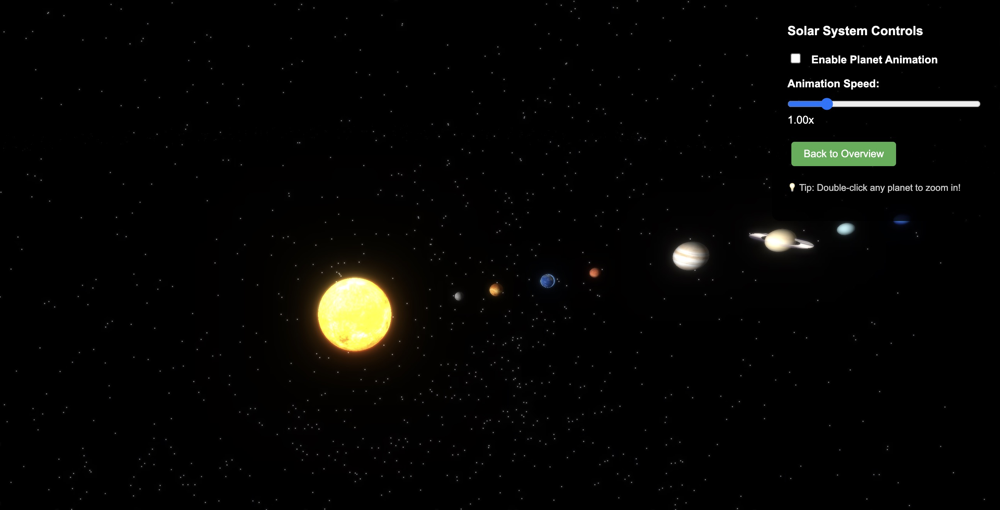
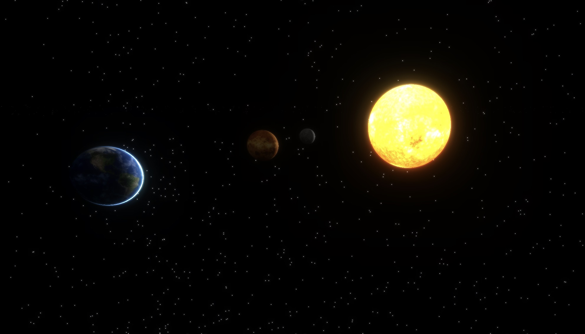

# Solar System 3D Explorer

An interactive 3D Solar System explorer built with Three.js.

## Features

- 🌟 Sun, 9 planets (including Pluto), and the Moon
- 🪐 Realistic orbital animation
- 🌌 Asteroid belt simulation
- 🎮 Full keyboard and mouse controls
- 📱 Click planets to view details
- ⭐ Beautiful starfield background

## Screenshots





## Controls

### Mouse
- **Drag**: Rotate camera
- **Scroll**: Zoom in/out
- **Click planet**: Show planet info

### Keyboard
- **W/A/S/D**: Move camera forward/left/back/right
- **Space**: Move up
- **Shift**: Move down

## How to Run

1. Start a local web server in the project directory
2. Open `index.html` in the browser via the server URL

### Start a local server (Python):
```bash
# Python 3
python -m http.server 8000

# Python 2
python -m SimpleHTTPServer 8000
```

Then open: `http://localhost:8000`

## Tech Stack

- **Three.js**: 3D graphics rendering
- **HTML5/CSS3**: User interface
- **JavaScript ES6**: Application logic

## Celestial Objects

This project includes:
- Sun (central star)
- Mercury, Venus, Earth, Mars (inner planets)
- Jupiter, Saturn, Uranus, Neptune (outer planets)
- Pluto (dwarf planet)
- Moon (Earth's satellite)
- Asteroid belt (between Mars and Jupiter)

Each planet features:
- Approximate relative size
- Realistic orbital distance
- Different orbital speeds
- Detailed description

## Special Effects

- Ring systems for Saturn and Uranus
- Moon orbiting Earth
- Slowly rotating asteroid belt
- Realistic lighting
- Shadow rendering
